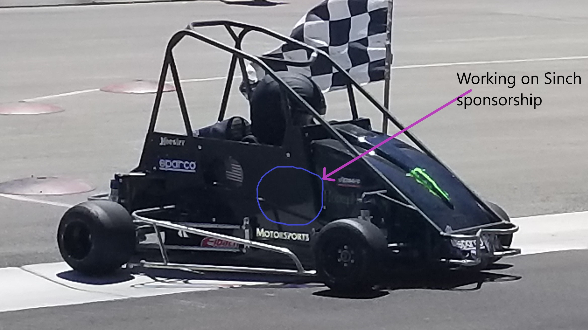
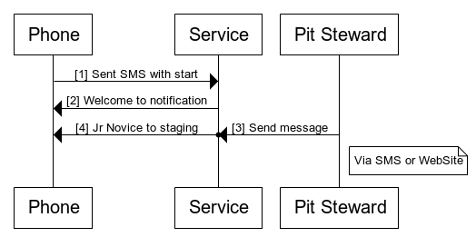
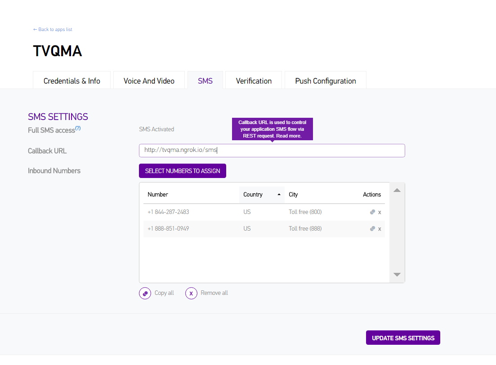

## Building a simple SMS notification system with Sinch

A few months back my son and I started to race [quarter midgets]([quarter midgets](https://en.wikipedia.org/wiki/Quarter_Midget_racing), For myself, it has been loads of fun and steep learning curve believe me a perfectly aligned cells without using tables in HTML is pretty easy compared to tuning a racing chassis. Its also amazing to meet the people that put in the hard work and their heart to make racing (somewhat) affordable for kids. Anyway, everyone can contribute to the club with what they are good at (in my case coding a skill I am at least somewhat competent in) in this article I’ll show you a simple notification system I built yesterday for the Western Grands. Every year there are three main evens in Quarter Midget racing one for each region and one dirt event. This year our club [Tri Valley Quarter Midget Association](https://www.tvqma.org/) has the honor to host it.



This year 250 cars will come from all over the western states and race at our track for three intensive days in 17 different classes and about 125 drivers. To manage and have all races done in time there is a lot of logistics that need to happen to make sure that people are in the right place at the right time. To give you a glance on the schedule, two days of parking of trailers, every racecar needs to be checked that they have the right fuel, inspected for safety, make sure it has enough weight, transponders to measure lap times. And last but not least, the main purpose getting the kids out on the track. Each kid has practice laps, qualifying laps, heats, Lower Mains and the A mains. In a club race; this is all done in one day by an announcer who will announce who needs to be where. This year it's just too big, if you are back in your trailer there will be no way to hear the announcer during the Grands. To solve this, a simple SMS system for the Tower and Pit stewards to send SMS to everyone on whats going on seems like a good idea. We believe this will help people to be on time and also have the confidence to relax and have fun! After all that’s why we are doing this.
If you live in the bay area and want to see some talented kids race stop by at the TVQMA June 28-30, or come by this Saturday 16th of June and you kids can try a race car for real.

## Prerequistes
This article assumes that you are familiar with .net core and ASP.net MVC patterns, you will also need an account and a phone number with Sinch. 

## Time to build 
[screen shot]
So the basic idea is that a track official that would announce something in PA system also should have the tool to send a quick SMS with the same message. Because of regulations in the US, we are going to use Toll-free numbers to send SMS to ensure high thruput  and no spam filter (Not because its free for users (it's not [link to an article about TFN SMS Katie]). If you live in Europe, you can pick any number you want in most countries. 

First I need to collect phone numbers from racers, we are doing that by advertising on social media and having signs around the track where tell people to send an SMS containing start to +1 888-851-0949. When they do we add the sender to the subscriber's database. 
Next thing I need is methods for officials to send out messages. In this case, we have two ways: 
1. with a website, 
2. A whitelist of numbers that can send SMS to above number and anything they send is sent to the everyone in the list. 




### Managing signups via SMS
I created basic ASP.Net core MVC project enabled Asp.Net identity, bought a number in the [portal](https://portal.sinch.com/#/numbers) (Yeah, I know we should have way more countries in stock, its coming but for now mail me if you need a particular country.). Create an app and assign the number a webhook url to receive SMS. 



I use the awesome tool [ngrok](https://www.sinch.com/tutorials/getting-second-number-testing-sinch-callbackswebhooks-ngrok/) during development. 
Next I need to add a WebApi controller to handle all incoming SMS.

*SMSController.cs*
```csharp
[Produces("application/json")]
public class SMSController : Controller {
    private readonly ApplicationDbContext _dbContext;

    public SMSController(ApplicationDbContext dbContext) {
        _dbContext = dbContext;
    }

    [Route("/SMS")]
    public async Task<OkResult> Post([FromBody] IncomingMessageEvent model) {
        var smsApi = SinchFactory.CreateApiFactory("keyfrom dashboard", "secretstuff").CreateSmsApi();
        var fromNumber = "+" + model.From.Endpoint;
        if (model.Message.Trim().ToLower() == "start" || model.Message.Trim().ToLower() == "unstop") {
            if (!_dbContext.Subscribers.Any(m=> m.Number == fromNumber)) {
                _dbContext.Subscribers.Add(new Subscriber
                {
                    Number = fromNumber
                });
                await _dbContext.SaveChangesAsync();
            }
            await smsApi.Sms(fromNumber,
                    "Thank you! \nYou are now subscribed to Western Grands 2018 Notifications.\n\nSms by Sinch https://www.sinch.com/")
                .WithCli("+18442872483").Send();
            return Ok();
        }
        if (model.Message.Trim().ToLower() == "stop") {
            if (_dbContext.Subscribers.Any(m => m.Number == fromNumber)) {
                _dbContext.Subscribers.Remove(_dbContext.Subscribers.First(m=> m.Number == fromNumber));
                await _dbContext.SaveChangesAsync();
            }
            return Ok();
        }
        await smsApi.Sms(fromNumber,
                "Sorry, we only support Start and stopm if you have any questions please contact TVQMA")
            .WithCli("+18442872483").Send();
        return Ok();
    }
}
```

There is a few things here, first I want to reach to "Start" and "Stop" keyword, the unstop command kicks in if you start en then send in stop, then you need to send unstop to reanble sms from that number. 
In the start command I check that the subscriber doesnt exist, if it does not add it to the database, and finally send out the welcome message. I opted for sending the message even if the subscriber exists since its a command the progtram still understands. **One Gotcha here, we send you the number with out + in e 164 format, but we require you to send it with a + to make sure its a country code hence the var fromNumber = "+" + model.From.Endpoint;**

I also wanted to support stop to remove yourself and also provide somewhat meaningful feedback if you send in something we dont under stand. 

### Subscriber data class 
The subscriber dataclass serveres to keep track of the peole that sends in a start sms, its using Entity framework adn in the github repo you will also see that a scafolded the whole class to provide the club with a crude admin of subscribers. 

*Susbscriber.cs*
```csharp
public class Subscriber {
	[Key]
	[DatabaseGenerated(DatabaseGeneratedOption.Identity)]
	public int SubscriberId { get; set; }
	public string Number { get; set; }
}
```

And then I added it as a db set to the ApplicationDbContext as a DBset<Subscriber>  

*ApplicationDbContext.cs*
```csharp
public class ApplicationDbContext : IdentityDbContext<ApplicationUser> {
    public DbSet<Message> Messages { get; set; }
    public DbSet<Subscriber> Subscribers{ get; set; }
    public DbSet<SendLog> SendLogs { get; set; }

    public ApplicationDbContext(DbContextOptions<ApplicationDbContext> options)
        : base(options)
    {
    }

    protected override void OnModelCreating(ModelBuilder builder)
    {
        base.OnModelCreating(builder);
        // Customize the ASP.NET Identity model and override the defaults if needed.
        // For example, you can rename the ASP.NET Identity table names and more.
        // Add your customizations after calling base.OnModelCreating(builder);
    }
    }
```

As you can see i use the Sinch Nuget package to help me out https://www.nuget.org/packages/Sinch.ServerSdk/ while not necessary it sure makes it easier when it comes to signing request. 
 
## Sending SMS notifications. 
I wanted  to store each message i send, and also keep a log of of who I send it to so I added two more classes to support this. 

*Message.cs*
```csharp
public class Message {
    [Key]
    [DatabaseGenerated(DatabaseGeneratedOption.Identity)]
    public int MessageId { get; set; }
    public String MessageContent { get; set; }
    public DateTime DateSent { get; set; }
    public virtual IEnumerable<SendLog> Logs { get; set; }
}
```

and *SendLog.cs*
```csharp
public class SendLog {
    [DatabaseGenerated(DatabaseGeneratedOption.Identity)]
    public int SendLogId { get; set; }
    public int SubscriberId { get; set; }
    public int MessageId { get; set; }
    public string SinchMessageId { get; set; }
    public DateTime DateSent { get; set; }
    public DateTime DateDelivered { get; set; }
    public string Status { get; set; }
    public virtual Subscriber Subscriber { get; set; }
    }
```

I wanted to show this in a dashboard like page so a ViewModel is also needed

*DashboardModel.cs*
```
public class DashboardModel {
    public int SubscriberCount { get; set; }
    public string Message { get; set; }
    public List<Message> LastMessages { get; set; }
}
```

Finally a a Controller and a View 

*MessageContoller.cs*
```
public class MessagesController : Controller {
    private readonly ApplicationDbContext _context;
    public MessagesController(ApplicationDbContext context) {
        _context = context;
    }

    [Route("/dashboard")]
    [HttpGet]
    public IActionResult Dashboard()  {
        var model = new DashboardModel();
        model.SubscriberCount = _context.Subscribers.Count();
        model.LastMessages = _context.Messages.OrderByDescending(m => m.DateSent).Take(10).ToList();
        model.Message = "";
        return View(model);
    }

    [Route("/dashboard")]
    [HttpPost]
    public async Task<IActionResult> Dashboard(DashboardModel model) {
        var smsApi = SinchFactory.CreateApiFactory("key", "secret").CreateSmsApi();
        if (ModelState.IsValid)
        {
            await CreateAndSendMessage(new Message
            {
                MessageContent =  model.Message,
                DateSent =  DateTime.UtcNow
            });
        }
        model.SubscriberCount = _context.Subscribers.Count();
        model.LastMessages = _context.Messages.OrderByDescending(m => m.DateSent).Take(10).ToList();
        model.Message = "";
        return View(model);
    }
}

```

I want to make it super easy for officals to send a quick message and getting drivers to stageing is one of the most critical steps, if you dont show up on time for your race you will miss you race. 

*Dashboard.cshml*
```
@model TVQMANotifications.Models.DashboardModel
@{
    ViewBag.Title = "TVQMA Dashboard";
}

<H1>Send an SMS to 844-287-2483 with the the word START in it.</H1>
<div class="row">
    <div class="col-md-6">
        <h2>Send a new notification</h2>
        <form asp-action="Dashboard">
            @*<input type="hidden"  value="Jr Novice to Staging"/>*@
            <input type="submit" asp-for="Message" value="Jr Novice to staging" class="btn btn-default" />
            <input type="submit" asp-for="Message" value="Sr Novice to staging" class="btn btn-default" />
            <input type="submit" asp-for="Message" value="Jr Animal to staging" class="btn btn-default" />
            <input type="submit" asp-for="Message" value="Sr Animal to staging" class="btn btn-default" />
            <input type="submit" asp-for="Message" value="Hvy Animal to staging" class="btn btn-default" />
            <input type="submit" asp-for="Message" value="Jr Honda to staging" class="btn btn-default" />
            <input type="submit" asp-for="Message" value="Sr Honda to staging" class="btn btn-default" />
            <input type="submit" asp-for="Message" value="Hvy Honda to staging" class="btn btn-default" />
            <input type="submit" asp-for="Message" value="Jr Stock to staging" class="btn btn-default" />
            <input type="submit" asp-for="Message" value="Mod  to staging" class="btn btn-default" />
            <input type="submit" asp-for="Message" value="Lt 160 to staging" class="btn btn-default" />
            <input type="submit" asp-for="Message" value="Hvy 160 to staging" class="btn btn-default" />
            <input type="submit" asp-for="Message" value="B to staging" class="btn btn-default" />
            <input type="submit" asp-for="Message" value="AA/Modified World to staging" class="btn btn-default" />
            <input type="submit" asp-for="Message" value="Jr Half to staging" class="btn btn-default" />
            <input type="submit" asp-for="Message" value="Lt World Formula to staging" class="btn btn-default" />
            <input type="submit" asp-for="Message" value="Hvy World Formula to staging" class="btn btn-default" />
        </form>        
        <form asp-action="Dashboard">
            <div asp-validation-summary="ModelOnly" class="text-danger"></div>
            <div class="form-group">
                <label asp-for="Message" class="control-label"></label>
                <textarea asp-for="Message" class="form-control" ></textarea>
                <span asp-validation-for="Message" class="text-danger"></span>
            </div>
            <div class="form-group">
                <input type="submit" value="Send" class="btn btn-default" />
            </div>
        </form>        
    </div>
    <div class="col-md-6">
        <h2>Number of Subscribers @Model.SubscriberCount</h2>
        <table class="table">
            <thead>
            <tr>
                <th colspan="2">
                    Latest messages
                </th>
                <th>
                </th>
                <th></th>
            </tr>
            </thead>
            <tbody>
            @{
                var i = 0;
            }
            @foreach (var item in Model.LastMessages)
            {
                i =++ i;
                <tr  class="@(i == 1 ? "sucess" : "")" style="background: @(i == 1 ? "#dff0d8" : "")">
                    <td >
                        @item.DateSent.AddHours(-7)
                    </td>
                    <td>
                        @Html.DisplayFor(modelItem => item.MessageContent)
                    </td>

                    <td>
                        <a asp-action="Details" asp-route-id="@item.MessageId">Details</a>
                    </td>
                </tr>
            }
            </tbody>
        </table>

    </div>
    <div class="row">
        <div class="col-md-6">
            To unsubscibe sent stop to same number
        </div>
    </div>
</div>
```

Now its ready to try out, you will find all teh source code on Github (link) with some more bells and whistles.


 
